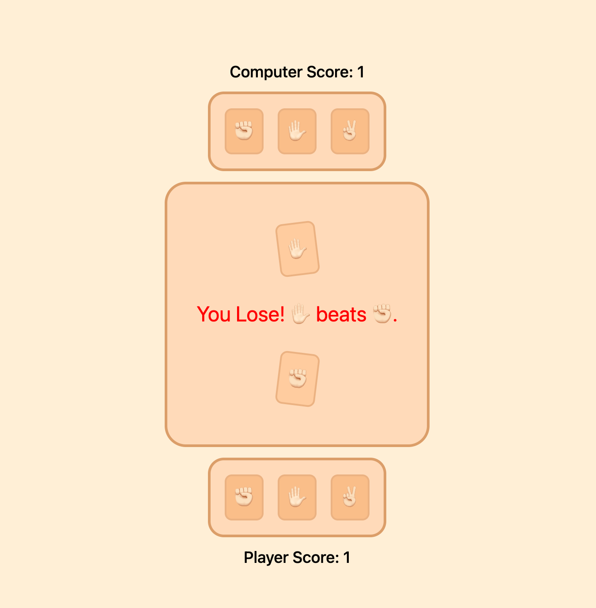

# Odin: Rock Paper Scissors

This exercise is a part of the Odin Project fundamentals course. It is meant to demonstrate the basics of Javascript such as:
- functions
- event listeners
- manipulating DOM elements
- logging to the console
- CSS animations
- creating and styling a frontend

A live demo can be found [here](https://tmprk.github.io/rock-paper-scissors)

# Gameplay

  
   

